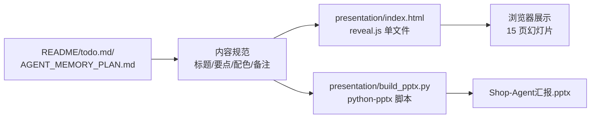

## 用户需求

为现有的 Shop Agent 项目（基于 RAG + Agent + Tool Calling 的电商管理客服系统）生成一份用于课程汇报的 PPT。需同时产出 HTML 版（课堂展示主用）与 .pptx 版（交付老师）两种形式，内容保持一致，共约 15 页，讲解时长约 10 分钟。

## 产品概述

一份结构为"背景 → 技术 → 演示 → 总结"的标准学术汇报 PPT，基于项目真实代码与已完成的开发里程碑（todo.md、AGENT_MEMORY_PLAN.md）组织内容。HTML 版采用 reveal.js 单文件方案，支持键盘翻页、进度条、章节导航；PPTX 版由 python-pptx 脚本生成，与 HTML 版逐页对齐，方便老师下载存档。

## 核心功能

- 封面 + 目录 + 四大板块共 15 张幻灯片
- 背景：电商客服痛点与项目定位
- 技术：整体架构、Tool Calling、RAG、Router Agent 意图路由、Agent Memory 三阶段压缩
- 演示：登录/对话界面、订单查询、产品推荐、多轮压缩效果（用 CSS 绘制界面示意框作占位）
- 总结：完成情况、后续工作、致谢 & Q&A
- 学术清爽视觉风格：白底 + 深蓝(#1F3A68) + 蓝绿强调(#2E86C1) + 中灰辅助，页脚统一显示「Shop Agent · 课程汇报」+ 页码
- 遵守事实硬约束：量化指标标注来源，未实现功能列为后续工作，不虚构

## 技术栈选择

- **HTML 版 PPT**：reveal.js 4.x（通过 CDN 引入，零构建）+ 原生 HTML/CSS/JS 单文件；内嵌少量 SVG 图示，避免外链失效
- **PPTX 版生成**：Python + python-pptx（需新增到 requirements，或在 build 脚本中独立 pip 安装说明）
- **字体**：CSS 层级 fallback：`"PingFang SC", "Microsoft YaHei", "Segoe UI", sans-serif`
- **图示**：Mermaid（HTML 版走 reveal-mermaid 或直接预渲染 SVG）+ 纯 CSS 绘制的"界面示意框"
- **托管方式**：纯静态文件，双击 `index.html` 即可在浏览器打开

## 实施方法

1. **HTML 版先行**：搭建 reveal.js 骨架 → 用蓝灰学术主题覆盖默认样式 → 逐页写内容 → 嵌入流程图（Mermaid 或 inline SVG）。reveal.js 的 `data-background-color`、section 分页、`fragment` 动效足以满足需求，不引入额外框架。
2. **PPTX 版镜像生成**：写 `build_pptx.py`，用 python-pptx 创建 16:9 空白版式幻灯片，逐页按 HTML 的标题+要点+图示占位构造文本框与简单形状；配色与字号对齐视觉规范。
3. **内容保真**：所有技术描述、代码片段、API 列表、Memory 阶段收益数字均直接来自 README/todo.md/AGENT_MEMORY_PLAN.md，收益数字明确标注"预期收益（来自 AGENT_MEMORY_PLAN.md）"。
4. **讲稿辅助**：每页在 HTML 的 `<aside class="notes">` 及 PPTX 的 `notes_slide` 内写 2-4 句讲解要点，便于汇报者过稿。

## 关键技术决策

- **选 reveal.js 而非 impress.js/marp**：reveal.js 成熟、中文社区多、单文件可运行；课堂展示兼容性最佳。
- **选 python-pptx 而非 LibreOffice 转换**：脚本化可控，配色字号精准，跨平台无依赖。
- **不使用真实截图**：以 CSS 绘制"浏览器外框 + 聊天气泡"示意，避免 PPT 体积膨胀；在备注中提示"建议替换为真实运行截图"。
- **图示优先 inline SVG / CSS**：离线可用，避免 CDN 图片加载失败。

## 执行细则

- 不修改业务代码；新增内容全部隔离在 `presentation/` 子目录下，零侵入。
- reveal.js 通过 CDN（jsDelivr）引入，`index.html` 单文件；备注："无网环境时可改为本地 js/css 文件"。
- python-pptx 仅作为构建时依赖，不写入主 `requirements.txt`；`presentation/README.md` 中单独列出 `pip install python-pptx`。
- 收益数字（Token ↓80%、成本 ↓76%）每次出现都带"预期收益"前缀与出处脚注。
- Memory 阶段 4、JWT 签名、密码哈希升级 等归入"后续工作"幻灯片，明确标注"未完成 / 已识别"。

## 架构设计



两份产物共用同一套「内容规范 + 视觉规范」源数据，保证一致性。

## 目录结构

```
Shop-Agent/
└── presentation/                     # [NEW] 课程汇报材料目录，隔离于业务代码
    ├── index.html                    # [NEW] HTML 版 PPT 主文件。基于 reveal.js 4.x（CDN），
    │                                 #   包含 15 个 <section>：封面、目录、背景、定位、技术栈、架构图、
    │                                 #   Tool Calling、RAG、Router Agent、Agent Memory 三阶段、亮点、
    │                                 #   演示页 ×2、总结、致谢。每页含 <aside class="notes"> 讲稿。
    │                                 #   自定义 CSS 覆盖默认主题为白底+深蓝(#1F3A68)+蓝绿(#2E86C1)+
    │                                 #   中灰(#566573)，字体 PingFang SC/微软雅黑 fallback。
    │                                 #   页脚固定显示 "Shop Agent · 课程汇报 · 2026" + 页码。
    ├── assets/
    │   ├── architecture.svg          # [NEW] 系统整体架构图（前端→FastAPI→Router→Order/RAG→LLM/DB）
    │   ├── rag-flow.svg              # [NEW] RAG 流程图：query→embedding→ChromaDB→prompt→LLM
    │   ├── tool-calling.svg          # [NEW] Tool Calling 流程图：LLM→tool_calls→执行→回喂
    │   └── memory-stages.svg         # [NEW] Agent Memory 三阶段示意（Buffer/场景感知/LLM 压缩）
    ├── build_pptx.py                 # [NEW] python-pptx 构建脚本。定义 15 页内容数据结构（标题/
    │                                 #   要点/备注），按学术配色创建 16:9 幻灯片；为每页添加标题文本框、
    │                                 #   要点列表、页脚、页码；必要页绘制简单形状示意流程图。
    │                                 #   含颜色常量（深蓝/蓝绿/中灰/浅灰）与字号常量（标题 36、副标题
    │                                 #   24、正文 20、注解 16）。运行后输出 Shop-Agent汇报.pptx。
    ├── Shop-Agent汇报.pptx            # [GENERATED] 由 build_pptx.py 生成的 PPTX 产物（首次运行后出现）
    └── README.md                     # [NEW] 说明：如何本地打开 index.html、如何用 python 运行
                                      #   build_pptx.py（含 pip install python-pptx 步骤）、
                                      #   如何修改内容与配色；列明所有事实来源文件。
```

## 内容对齐清单（15 页题目确认）

1. 封面｜2. 目录｜3. 背景与痛点｜4. 项目定位与目标｜5. 技术栈总览｜6. 整体架构图｜7. Tool Calling（订单查询）｜8. RAG（产品推荐）｜9. Router Agent（意图路由）｜10. Agent Memory 三阶段｜11. 系统亮点小结｜12. 功能演示（一）登录+智能对话｜13. 功能演示（二）订单/推荐/多轮｜14. 项目总结与后续工作｜15. 致谢 & Q&A

## 设计风格

采用学术清爽风格，贴近论文汇报与高校课程展示。整体白底蓝灰配色，强调内容可读性与专业度，避免花哨动效。标题使用深蓝色 #1F3A68 与粗字重体现权威感，强调内容（数字、技术名词、章节编号）用蓝绿色 #2E86C1 做点缀。页面留白充足，采用 12 栏对齐，标题+要点+图示三段式布局。流程图使用简洁线条与蓝灰填充，避免立体阴影与渐变。

## 页面布局规范

- **封面页**：左上角项目名 Logo 占位（"SA" 圆形徽标），居中大标题"Shop Agent · 电商管理客服系统"，副标题"基于 RAG + Agent + Tool Calling 的课程汇报"，底部作者/日期/课程名。
- **目录页**：四大板块卡片横向排列，编号 01/02/03/04，带章节图标（🛒 背景｜⚙️ 技术｜💬 演示｜📊 总结）。
- **内容页**：顶部深蓝细条 + 章节标签（如"02 技术实现"）+ 页面标题；主体左文右图（或上文下图）三到五个要点 bullet；底部统一页脚 + 页码。
- **演示页**：用 CSS 绘制浏览器外框+侧边栏+聊天气泡示意，气泡标注「用户输入 / Agent 回复 / 意图标签」。
- **总结页**：左列"已完成 ✓"，右列"后续工作"，两列平衡；致谢页单句大字居中。

## 动效与交互

- reveal.js 默认淡入/滑动切换（`transition: slide`），幻灯片内 bullet 使用 `fragment fade-in` 逐条呈现。
- 保留键盘翻页（←/→）、按 S 打开演讲者备注视图、按 ESC 打开幻灯片总览。
- 避免自动播放与循环动画，保证汇报节奏可控。

## Agent Extensions

### Skill

- **ppt-implement**
- Purpose: 按最佳实践生成 HTML 版网页 PPT（reveal.js 方案），负责 `presentation/index.html`、自定义 CSS、SVG 图示与讲者备注的完整实现
- Expected outcome: 产出可直接在浏览器双击打开的单文件 HTML PPT，15 页内容与目录完全对齐，学术清爽风格落地到位，键盘翻页/备注/总览功能均可用

- **pptx**
- Purpose: 生成与 HTML 版逐页对齐的 `.pptx` 文件，用于交付老师存档
- Expected outcome: 通过 `build_pptx.py`（python-pptx）产出 `Shop-Agent汇报.pptx`，16:9 版式、15 张幻灯片、配色字号与视觉规范一致、每页含讲者备注